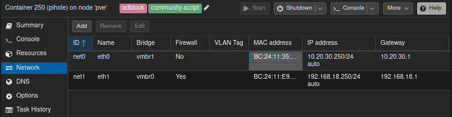

bash -c "$(curl -fsSL https://raw.githubusercontent.com/community-scripts/ProxmoxVE/main/ct/pihole.sh)"

ufw default deny incoming
ufw default allow outcoming
ufw allow DNS
ufw allow in on eth0
ufw enable
