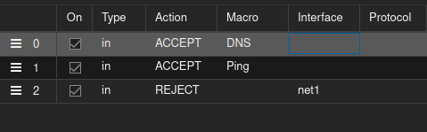

bash -c "$(curl -fsSL https://raw.githubusercontent.com/community-scripts/ProxmoxVE/main/ct/pihole.sh)"

need to delete getaway to net0 

default getaway need to be 192.168.18.1

ufw default deny incoming
ufw deny in on eth1
ufw allow in on eth1 to any port 53 proto udp
ufw allow in on eth1 to any port 53 proto tcp
ufw allow in on eth0
ufw enable

